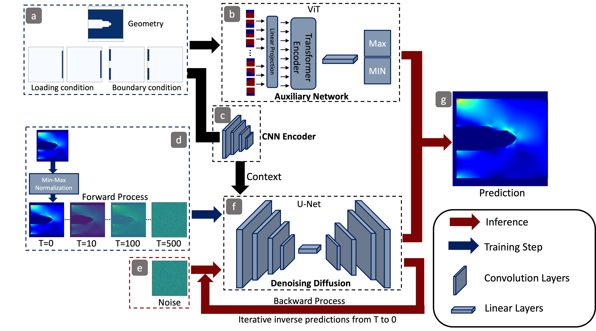
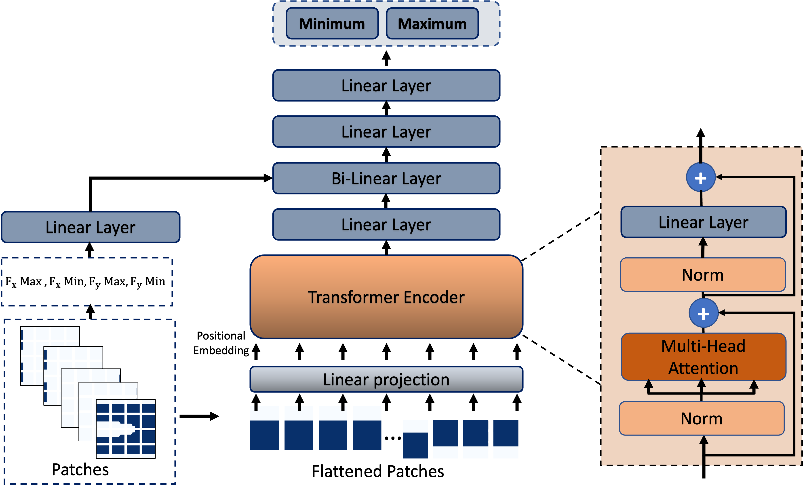

# StressD
Code for [StressD](https://papers.ssrn.com/sol3/papers.cfm?abstract_id=4478596) paper.
## Updating regularly (almost everyday)

## What is StressD?

## How does it work?

## Refrences
Diffusion code is based on [this](https://github.com/lucidrains/denoising-diffusion-pytorch) repository.
